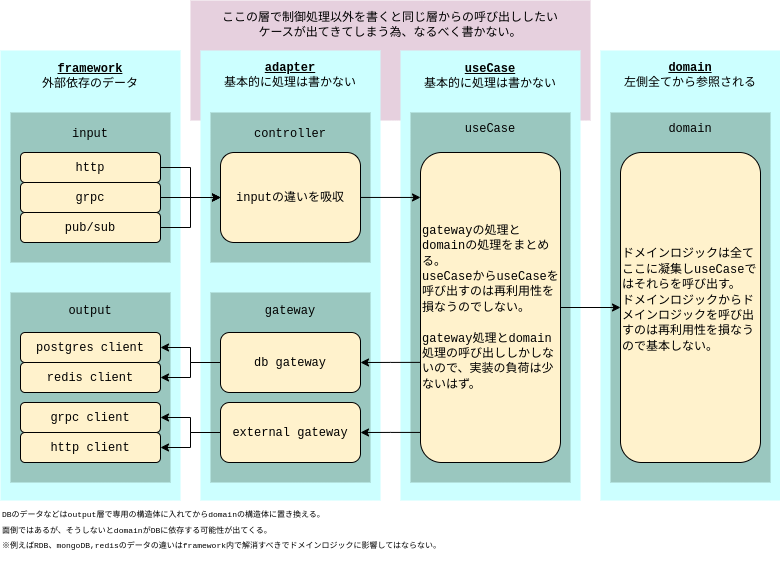

# setup

### 下記インストール

- docker (version 20.10.5)
- docker-compose (version 1.24.0)

### 立ち上げ

```
make install-tools
make build
make up
```

# xo

brew install xo/xo/xo

# ディレクトリ構成

[go standard project layout](https://github.com/golang-standards/project-layout/blob/master/README_ja.md)

# clean architecture

internal 以下に clean architecture の構成



# ドメインロジックの凝集

### backend/internal/4_domain に凝集。

## [primitive_object](backend/internal/4_domain/primitive_object)

string や int の基本的なデータ型に対するロジックを定義。
文字列の長さチェックや nil 判定など

## [type_object](backend/internal/4_domain/type_object)

primitive_object を利用して個別のデータ型を定義。
メールアドレスフォーマットチェックなど

## [group_object](backend/internal/4_domain/group_object)

type_object を複数組み合わせてドメインモデルを定義。

## [unusual_object](backend/internal/4_domain/unusual_object)

例外的な処理。

# grpc server client

## [grpc server](backend/internal/1_framework/in/go-grpc/person.go)

## [grpc client](backend/internal/1_framework/out/grpc_client/logic.go)

# http server

## [http server](backend/internal/1_framework/in/go-echo/v1/person/viaGRPC.go)

http request を grpc に変換して grpc サーバーにリクエストを送信。

# auth0 client

[auth0 client](backend/internal/1_framework/out/auth0_client/logic.go)

# microservice data candidate

### [マイクロサービス間の共通データ項目](backend/internal/4_domain/group_object/request_context.go)

マイクロサービス間の共通データ項目を定義。

```
RequestStartTime  httpかgrpcのリクエスト開始時間を格納
TraceID           uuidを格納
ClientIP          httpアクセス元のIPを格納
UserAgent         httpアクセス元のUserAgentを格納
UserID            認証ユーザーIDを格納
AccessToken       認証トークンを格納
TenantID          所属テナントIDを格納
Locale            ロケールを格納
TimeZone          タイムゾーンを格納
PermissionList    ユーザー権限を格納
```

RequestStartTime を利用して、マイクロサーバは timeout を設定する。

# dev environment

hot reload
debug mode

```

```
