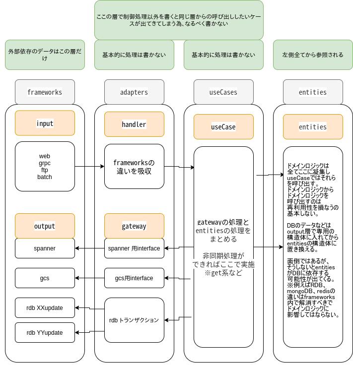

# setup

### 下記インストール

- docker (version 20.10.5)
- docker-compose (version 1.24.0)

### 立ち上げ

```
make build
make up
```

# tool

# xo

brew install xo/xo/xo

# grpc

PROTOC_VERSION=24.4
wget https://github.com/protocolbuffers/protobuf/releases/download/v${PROTOC_VERSION}/protoc-${PROTOC_VERSION}-linux-x86_64.zip
unzip protoc-${PROTOC_VERSION}-linux-x86_64.zip -d backend/

# clean architecture


# value object
backend/internal/4_domainに凝集。   


# grpc server client

# rest server client

# auth0 client

# microservice data behavior
