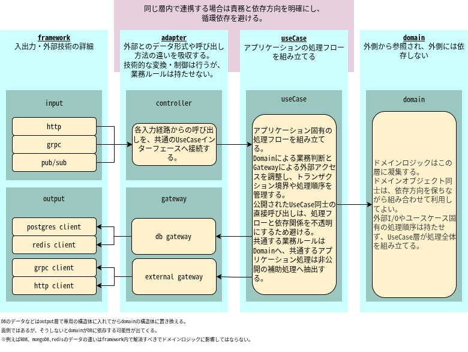

# setup

### 下記インストール

- docker (version ^20.10.5)
- docker-compose (version ^1.24.0)

### 立ち上げ

```
make install-tools
make build
make up
```

# ディレクトリ構成

[go standard project layout](https://github.com/golang-standards/project-layout/blob/master/README_ja.md)

# clean architecture

internal 以下に clean architecture の構成



# DDD の取り入れ方

このプロジェクトは DDD の考え方を取り入れていますが、package 名や一部の用語はプロジェクト内で扱いやすいようにカスタマイズしています。

DDD の標準用語をそのまま package 名にするのではなく、以下の対応で実装します。

| このプロジェクトの用語 | DDD で近い概念 | 役割 |
| --- | --- | --- |
| `primitive_object` | Primitive / base type wrapper | Go の基本型に対する共通バリデーションやフォーマットを扱う |
| `type_object` | Value Object | ドメイン固有の値と、その値単体で完結するルールを扱う |
| `group_object` | Entity / Aggregate | 複数の `type_object` をまとめ、識別子・ライフサイクル・状態変更を扱う |
| `service_object` | Domain Service | Entity や Value Object 単体に収まらない、複数オブジェクト間の業務ルールを扱う |

# ドメインロジックの凝集

ドメインロジックは `backend/internal/4_domain` に凝集します。

ただし、クリーンアーキテクチャを優先するため、domain は usecase / adapter / framework に依存しません。
DB、HTTP、gRPC、context、logger など外部都合の処理は domain に持ち込まない方針です。

#### [primitive_object](backend/internal/4_domain/primitive_object/_README.md)

基本データ型に対する共通ルールを扱います。

#### [type_object](backend/internal/4_domain/type_object/_README.md)

ドメイン固有の値オブジェクトを扱います。
例: `Email`, `UserID`, `TenantID`, `PermissionList`

#### [group_object](backend/internal/4_domain/group_object/_README.md)

Entity / Aggregate 相当のモデルを扱います。
例: `User`, `UserEmployment`

#### [service_object](backend/internal/4_domain/service_object/_README.md)

複数のオブジェクトにまたがる業務ルールを扱います。
例: `PrimaryEmploymentAssignmentPolicy`

# usecase と domain の境界

usecase はアプリケーション固有の処理順序を担当します。

- transaction 境界
- gateway / external gateway の呼び出し順序
- domain rule の適用
- HTTP / gRPC / PubSub から始まった処理の orchestration

domain は純粋な業務ルールを担当します。

- 値の妥当性
- Entity の更新可能条件
- Aggregate の不変条件
- 複数オブジェクト間の整合性

どちらに置くか迷う場合は、外部 I/O や処理順序に関係するものは usecase、外部 I/O に依存しない業務判断は domain に置きます。

# Ubiquitous Language

パッケージ名はプロジェクト独自の分類名を使いますが、type / method 名には業務語彙を反映します。

例:

- `User`
- `UserEmployment`
- `PrimaryEmploymentAssignmentPolicy`
- `UpdateUserProfileWithPrimaryEmployment`

DB テーブル名や transport の DTO 名ではなく、業務上の言葉を中心に命名します。

# interface の命名規約

層をまたいで依存を受け渡す interface は、プロジェクト内ルールとして `ToXXXX` 形式で命名します。

例:

- `ToUseCase`
- `ToController`
- `ToGatewayDB`
- `ToPostgres`
- `ToAuth0`

`ToXXXX` は「現在の層から XXXX 側へ依存を向けるための境界」を表します。
一般的な Go の慣習では責務名を使う interface も多いですが、このプロジェクトではクリーンアーキテクチャ上の接続先を明示し、層間の依存関係を読みやすくするため `ToXXXX` に統一します。

# grpc server client

#### [grpc server](backend/internal/1_framework/in/go-grpc/user.go)

#### [grpc client](backend/internal/1_framework/out/external/grpc_client/logic.go)


# auth0 client

[auth0 client](backend/internal/1_framework/out/external/auth0_client/logic.go)

# microservice data candidate

#### [マイクロサービス間の共通データ項目](backend/internal/1_framework/middleware/request_context/model.go)

マイクロサービス間で伝搬する共通データ項目を定義。

```
RequestStartTime  リクエスト開始時間を格納
TraceID           uuidを格納
ClientIP          httpアクセス元のIPを格納
UserAgent         httpアクセス元のUserAgentを格納
UserID            認証ユーザーIDを格納
AccessToken       認証トークンを格納
TenantID          所属テナントIDを格納
Locale            ロケールを格納
TimeZone          タイムゾーンを格納
PermissionList    ユーザー権限を格納
```

上記の項目は gRPC metadata / PubSub header で伝搬する。
HTTP middleware では ClientIP / UserAgent / Locale / TimeZone を HTTP request から取得し、RequestStartTime / TraceID は RequestContext 作成時に設定する。

RequestContext は RequestStartTime から TimeOutMillSecond を内部計算する。
TimeOutMillSecond は timeout 判定用の内部項目であり、現在は gRPC metadata / PubSub header では伝搬しない。

RequestContext はリクエスト伝搬や timeout 計算など transport / application 寄りの関心を含むため、業務ドメインそのものではなく middleware 側で管理します。
ただし、各項目の値制約は `type_object` を利用します。
